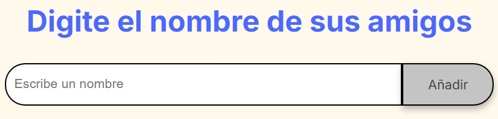
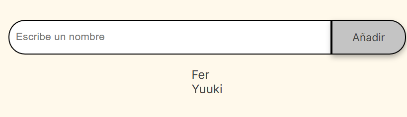

# 🎁 Amigo Secreto

Aplicación web simple para gestionar una lista de amigos y realizar un sorteo aleatorio para determinar quién es el "amigo secreto".

Permite:

- Agregar nombres a una lista.
- Eliminar nombres individualmente.
- Borrar toda la lista.
- Sortear un nombre de manera aleatoria.

## 📸 Vista previa


---

## 📂 Estructura del proyecto

```
.
├── index.html       # Estructura principal de la aplicación
├── style.css        # Estilos de la interfaz
├── app.js           # Lógica y funcionalidades
├── assets/          # Imágenes e íconos usados
└── README.md        # Documentación del proyecto
```

---

## 📦 Instalación

1. **Clonar el repositorio**

   ```bash
   git clone https://github.com/usuario/amigo-secreto.git
   cd amigo-secreto
   ```

2. **No requiere instalación de dependencias**  
   Este proyecto está hecho con HTML, CSS y JavaScript puro, sin frameworks ni librerías externas.

---

## 🚀 Ejecución del proyecto

1. Abrir el archivo `index.html` en tu navegador.

   - Puedes hacer doble clic en el archivo o arrastrarlo a una ventana del navegador.
   - También puedes usar un servidor local con VSCode + Live Server para mejor experiencia.

2. **Uso básico**:
   - Escribe un nombre en el campo de texto y pulsa **Añadir** o la tecla `Enter`.
   - Los nombres aparecerán en la lista.
   - Pulsa el botón **Sortear amigo** para obtener un nombre aleatorio.
   - Pulsa ❌ para eliminar un nombre o 🗑 para borrar toda la lista.

---

## ⚙️ Funcionalidades principales

- **Agregar nombres**: mediante el campo de texto y botón _Añadir_.  

- **Validación de entrada**: no se permiten campos vacíos.

- **Visualizar lista**: los nombres ingresados se muestran debajo del campo.  

- **Eliminar individualmente**: cada nombre al darle click aparecera un mensaje de confirmacion para borrarlo.

- **Borrar lista**: botón 🗑 que limpia todos los nombres y el resultado.

- **Sorteo aleatorio**: selección aleatoria de un nombre de la lista.


---

## ❗ Posibles problemas y soluciones

| Problema                              | Causa                                  | Solución                                                                                  |
| ------------------------------------- | -------------------------------------- | ----------------------------------------------------------------------------------------- |
| No funciona el botón "Añadir"         | El script `app.js` no se está cargando | Verifica que la ruta en `<script src="app.js" defer>` es correcta y que el archivo existe |
| No se muestra el resultado del sorteo | Lista vacía                            | Asegúrate de agregar nombres antes de sortear                                             |
| No se cargan estilos                  | Ruta incorrecta a `style.css`          | Verifica el atributo `href` en la etiqueta `<link>`                                       |
| Eliminar un nombre no funciona        | Código desactualizado en `app.js`      | Usar la última versión con botón ❌ por cada nombre                                       |

---

## 💡 Recomendaciones

- Si lo subes a GitHub Pages, recuerda que las rutas a `assets/` deben mantenerse correctas.
- Puedes personalizar colores y tipografía editando `:root` en `style.css`.
- Si quieres añadir persistencia, puedes guardar la lista en `localStorage`.

---

## 📜 Licencia

Este proyecto es de uso libre bajo la licencia MIT. Puedes modificarlo y adaptarlo para tus necesidades.
